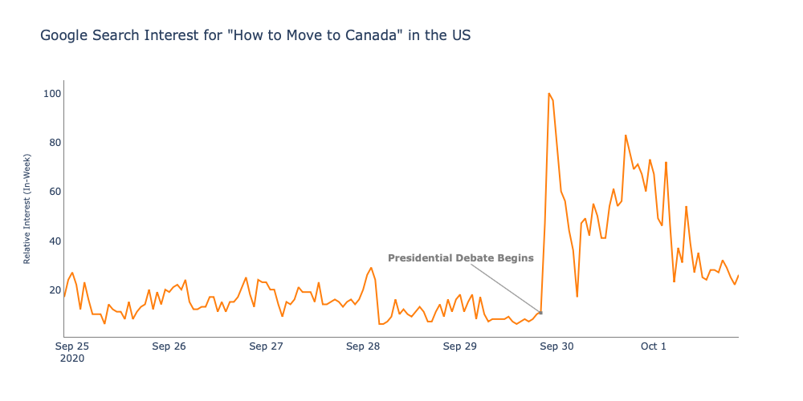

# MoveToCanadaSearches
Google Search Trends for "How to Move to Canada" in the US

## :floppy_disk: Data
Extracted Google Trends data for "How to Move to Canada" for September 24th, 2020 to October 1st, 2020. The Data is only for searches in the US. The data contained hourly records with a relative interest from 0 to 100 marking the search popularity relative to the max during that week. 

## :mag: Methodology
Used the python libraries pandas and plotly graph objects to graph the data in Jupyter notebooks. Indicated the date/time that the first presidential debate between Donald Trump and Joe Biden began. This corresponded with a sudden spike in the search term "How to Move to Canada" in the US.

## :computer: Final Visualization

## :wave: Author
Alex Kruczkowski
